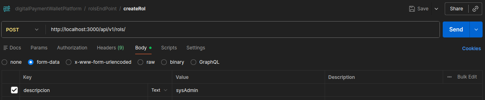
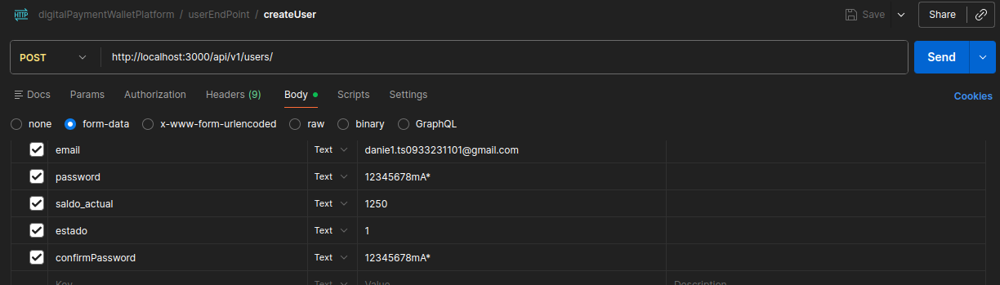
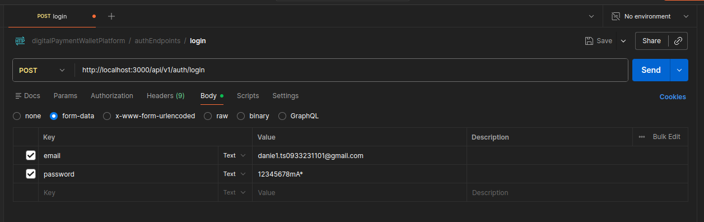
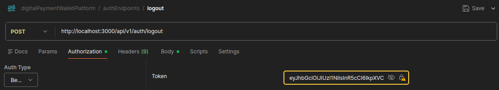
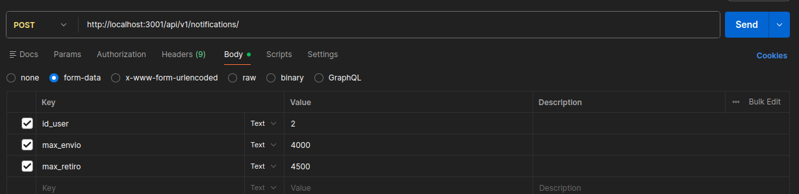
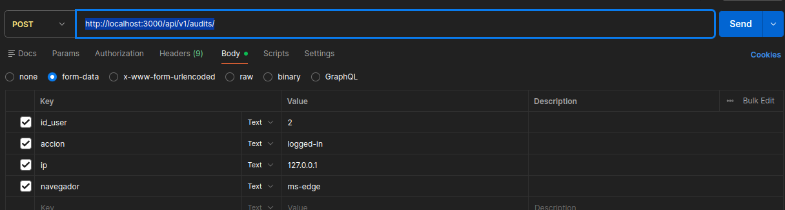

## Request

| Command                        | Description                                                                                                                                   |
| ------------------------------ | --------------------------------------------------------------------------------------------------------------------------------------------- |
| npm init -y                    | Crea un archivo package.json con la configuración básica:                                                                                     |
| npm install express cors       | express → crea el servidor web, cors → permite que tu frontend (por ejemplo, un HTML o React) haga peticiones al backend sin errores de CORS. |
| npm install --save-dev nodemon | Nodemon recarga automáticamente el servidor cuando guardas cambios (solo para desarrollo).                                                    |
| npm install mysql2             | Es para interactuar con bases de datos MySQL de manera eficiente                                                                              |
| npm install bcrypt             | bcrypt se utiliza para hash seguro de contraseñas                                                                                             |
| npm install dotenv             | Es para usar variables de entorno en el proyecto                                                                                              |

## Config

Configuración del package.json

```
"scripts": {
    "start": "node server.js",
    "dev": "nodemon server.js"
}
```

## NOTAS: Importantes
### Nota 01
_En Futuras actualizaciones la mayoria de endpoints con excepcion de los endpoints de **login** y **create user** van a requerir incluir un **id** y un **rol** en el body (cuerpo) de la request (peticion) para dar accesso a cualquier usuario a la mayoria de endpoints y abran endpoints que solo estaran disponibles segun el **rol** que se haya asignado al momento de crear el **usuario**._
### Nota 02
En la version actual los endpoints para actualizar la info de usuario funcion usando el formato "field" y "value", lo cual en futuras actualizaciones, se acutalizaran al formato estandar de una peticion de actualizacion HTTP **PUT** y estos endpoints actualez seran igualmente usados pero con metodos HTTP **PATCH** en lugar de HTTP **PUT**.

## Uso De Los Backend Endpoints

|Method|Endpoint|Informacion adicional a incluir| Ejemplo form-data | Ejemplo json |
|--------|--------------|----------|---|----|
|POST|http://localhost:3000/api/v1/rols/|description deberia ser algo como "admin", "user", "sysAdmin" solo una palabra.| |{"descripcion":"customerServiceSup"}|
|POST|http://localhost:3000/api/v1/users/|form-data o formato json -> incluir los campos de email, password, confirmPassword, saldo_actual, estado (0 o 1)||{"id_rol":3, "nombre":"Daniel Penia", "email":"danie1.s093323101@gmail.com", "password":"12345678mA*", "confirmPassword":"12345678mA*", "saldo_actual":1250, "estado": 1 }|
|POST|http://localhost:3000/api/v1/auth/login|form-data o formato json -> incluir los campos de email y password||{"email":"danie1.ts0933231101@gmail.com", "password":"12345678mA1*"}|
|POST|http://localhost:3000/api/v1/auth/logout|form-data o json -> incluir el jwt auth token y si usas postman en la pestaña de autorizacion seleccionar bearer token e ingresar el token generado en el login||No equivalente, se deber manipular el header de la request -> el campo **authorization**|
|POST|http://localhost:3000/api/v1/transactions/|form-data o formato json -> incluir los campos de tipo, monto, referencia, estado, descripccion||{"tipo":"accToAcc", "monto":500, "referencia":"NXeedmP", "estado":"completado", "descripcion":"Account to account"}|
|POST|http://localhost:3000/api/v1/notifications/|form-data o formato json -> incluir los campos de id_user, max_retiro, max_envio| |{"id_user":2, "max_envio":3500, "max_retiro":2500 }|
|POST|http://localhost:3000/api/v1/audits/|form-data o formato json -> incluir los campos de id_user, accion, ip, navegador||{"id_user":2, "accion":"logged-out", "ip:":"127.0.0.1", "navegador":"google chrome"}|